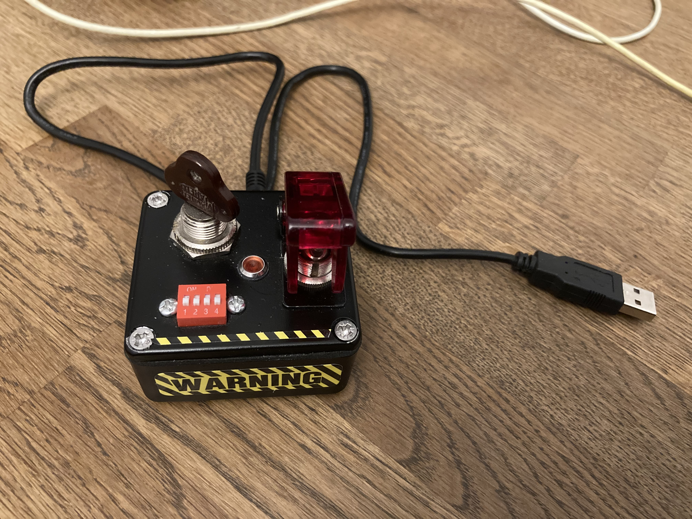
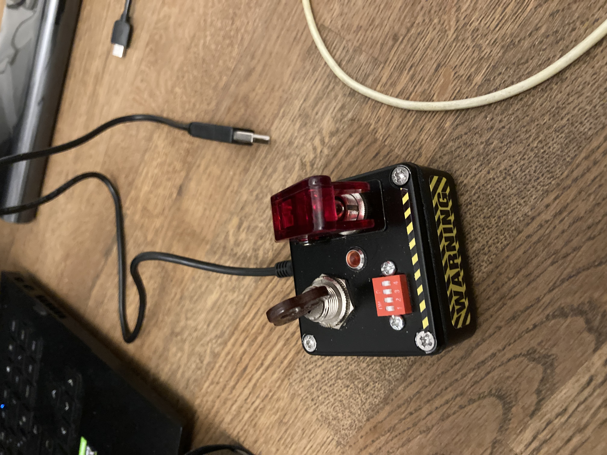
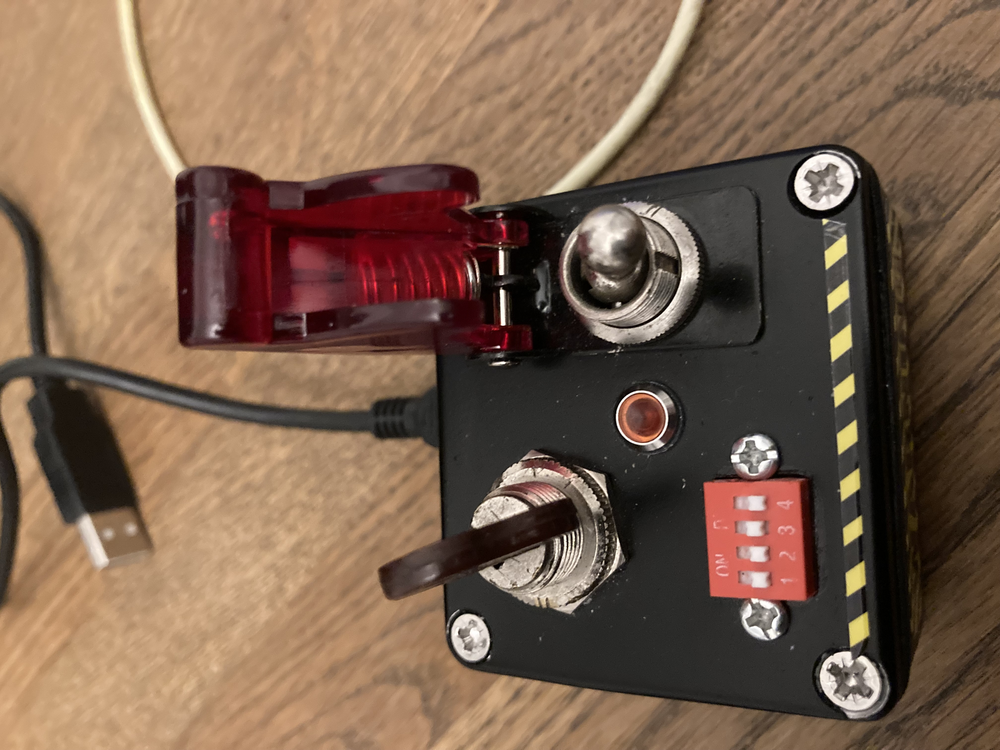

Description:
============

This an HID device able to emulate mouse and keyboard, in intentions it's intended to be used to launch tasks in Hollywood fashion, action movie style, emulating devices like Matrix EMP acrivation console, DEFCON 1 launch devices, etc.

So every task can became a mission ! :-)

Possible uses:
==============

* Serious:
** Test / Laboratory esperiments / Dangerous procedures,  where you need protection against involontary activation of software or hardware;

* Not Serious :-)
** Jokes;
** Trolling iper anxious / iper apprehensive collegues (I know , I'm a bad person :-) );
** Your fantasy is the limit here.

FEATURES:
=========

- It can emulate keyboards and mouse interaction;
- It support a safe switch ( the one with the key in the photos ) and a trigger button that launch the selected payload;
- A dip switch bank (used as a 4 bits number ) permits to select up to 16 different payloads.

Prerequisites:
==============

- Teensy++ 2.0;
- Key Switch;
- Button;
- DIP switch, 4 switches array;
- 220 - 360 OHMs resistor;
- LED, panel mountable; 
- box;
- USB Cable (mini);
- Decorative sticks (Optional).
